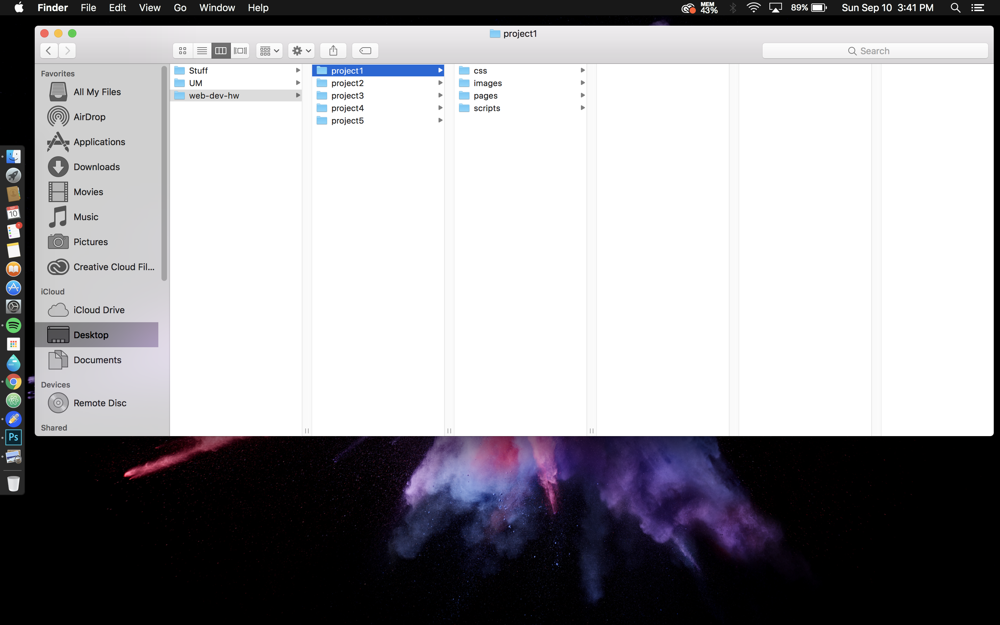

 # My First README.md

# *Project 1* by: Erika Horchover

***

## **Hello, Intro to Web-Dev. What's New?**

 I believe it is safe to say that there are many beginners in the same boat. After reading comments from the first Topic, we can agree that this is tough. So far, I have found that watching the videos and following instructions closely are helpful, yet this is still overwhelming. Really overwhelming. 

 The videos I am referring to are linked here: https://vimeo.com/mediaedonline


---

- This week I learned so many new terms and material.
- Getting the hang of Atom and Markdown.
- I think I have managed to follow along. Thank you Justine for the videos and help!
-This may be silly, but here is my first screenshot:


---
### The *-ode* in **'Code'**
1. Found out what the top left key is for- coding!
2. Code ex) `var `
```markdown
# This coding thing is a lot harder than anticipated.
```
