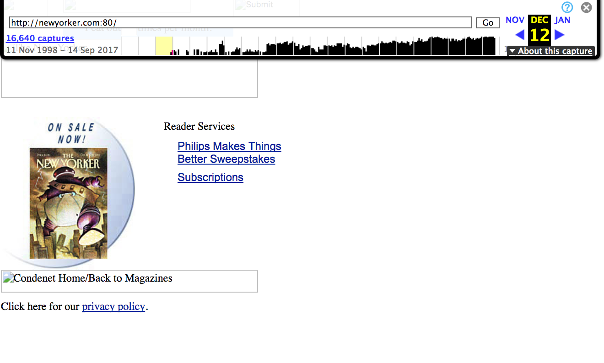
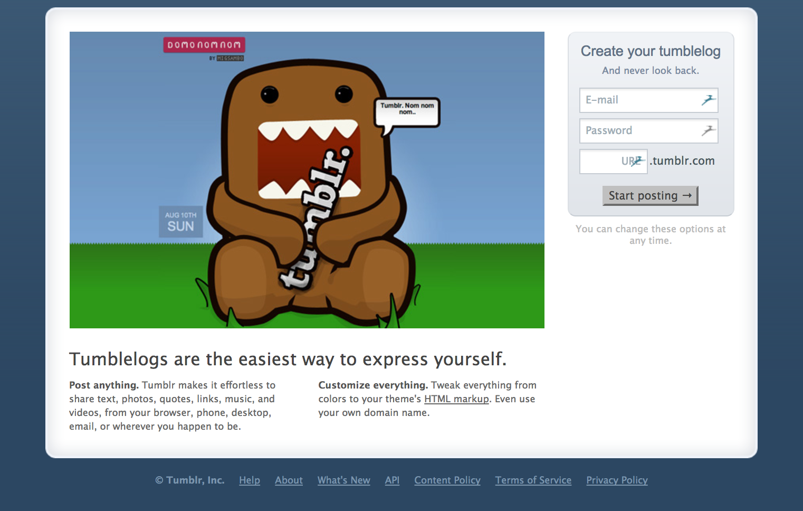

 # My First README.md

# *Project 1* by: Erika Horchover

***

## **Hello, Intro to Web-Dev. What's New?**

 I believe it is safe to say that there are many beginners in this class, all in the same boat. After reading comments from the first Topic, I think it is safe to say that this is in fact, a tough class. So far, I have found that watching the videos and following instructions closely are helpful. This is still all overwhelming and interesting that I am excited to challenege myself with something unfamiliar!

 The videos I am referring to are linked here: https://vimeo.com/mediaedonline

---
- This week I learned so many new terms and material.
- Getting the hang of Atom and Markdown.
- I think I have managed to follow along. Thank you Justine for the videos and help!
-Here is my first screenshot:

- After snooping, I see that in the last decade websites are more engaging and seem to put more of a visual emphasis as we advance.
For instance: Screen shots of tumblr in 2010 vs the New Yorker 1998:
-  
- Inspecting a tech site such as: https://techcrunch.com/, is cool to see all the different types of content and how it is organized. 
---

### The *-ode* in **'Code'**
1. Found out what the top left key is for- coding!
2. Code ex) `var `
```markdown
# This coding thing is a lot harder than anticipated.
```
