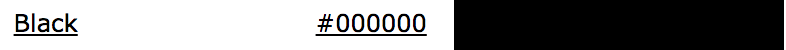
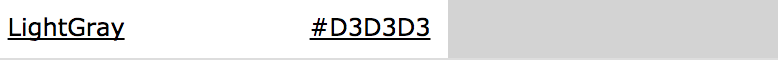
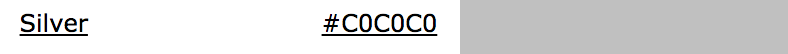
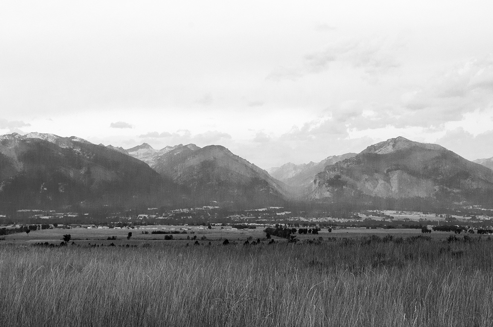

# Project 3
# "The Literature Showcase"
1. I would like to do a blog post.
2. This blog will mainly include my own photography work and  discuss experiences of local attractions, restaurants, stores and more.
3. For the bio, I will essentially cite what I had in the "about me" from project 2.
4. The color pattern I am considering is:

5. Visually, I want this to be: modern, clean lines and few distractions. The photographs should be the focus. Black and white, as well as color photography like these two are inspiring my vision:

---
# "Typography"
## Style Plan:
- This blog is ideally going to appeal to the general population, but is targeting those interested in Art/Photography.
- Initially, the first idea that came to mind was something almost editorial, yet bold and minimalistic. I may need to rethink my color scheme or change out a couple to get the desired outcome.
---
##Update
- No excuse, but the last couple weeks have been difficult. This assignment has paid the price, super annoyed at myself for that.
- Some good has come out of all this, I hope. I have had a difficult time with styling text separately but think I managed to fix most of it, except psuedo-elements and pseudo-classes. Struggling with those for some reason.
- I had to change the color pattern a bit to a point where I think it is decent enough.
- Honestly, I am not sure what direction this blog is going in but I think that's what great about it being a personal blog. It's like life, unpredictable and not going as planned.
